# VPN Proyecto 2
## 7690-15-15766 Israel Morales

### Proceso de configuración y sus componentes para el servicio VPN

Al configurar una cuenta en la plataforma de Microsoft Azure, primero se debe de configruar un grupo de recursos:

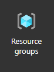

Dentro de este grupo de recursos primero se gestiona los siguientes componentes:

1. Virtual network
   - 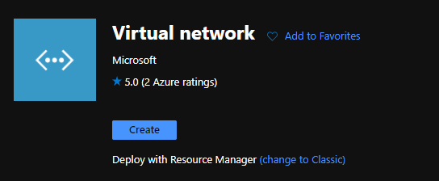
   - Creando las siguentes subredes
   - 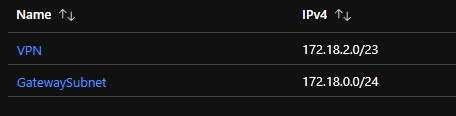
   - Dando como parametro general
   - 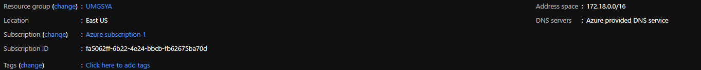
2. Virtual network gateway
   - Esta configuración nos permitira habilitar el acceso por VPN 
   - 
   - Establecemos los parametros
   - 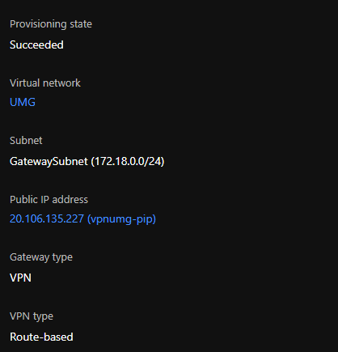
   - Y nos asiganara los siguientes datos, incluyendo una IP pública 
   - 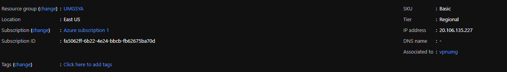
   - Esta configuración también nos permitira la asignación automatica de IP (DHCP) y traducción de nombre de dominio (DNS)
3. Active directory
    - En este grupo de directorios configuramos usuarios, grupos, politicas de empresa, etc.
    - 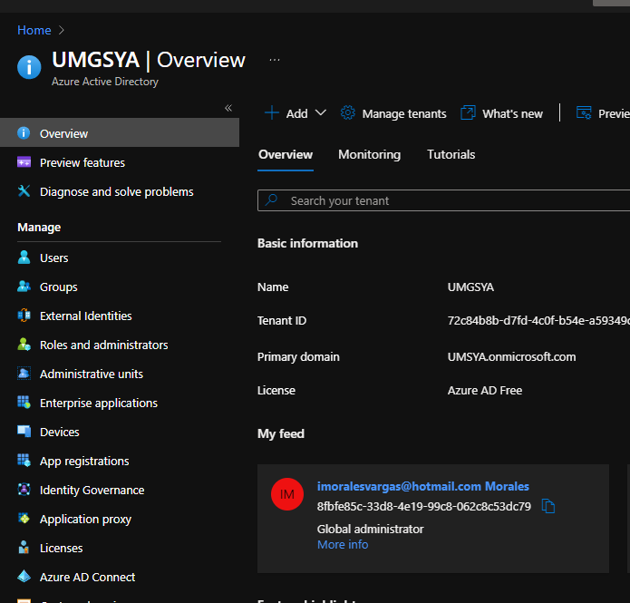
      - Usuarios
      - 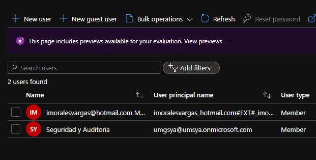
4. Azure VPN
    - Habilitamos el servicio de Azure VPN en nuestro active directory usando el enlace:
    - > https://login.microsoftonline.com/common/oauth2/authorize?client_id=41b23e61-6c1e-4545-b367-cd054e0ed4b4&response_type=code&redirect_uri=https://portal.azure.com&nonce=1234&prompt=admin_consent
    - El usuario con rol de Administrador global habilita el servicio
    - 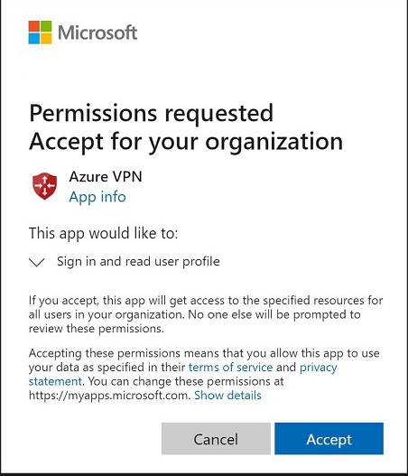
    - Agregamos los usuarios que tendran permitido conectarse por VPN
    - 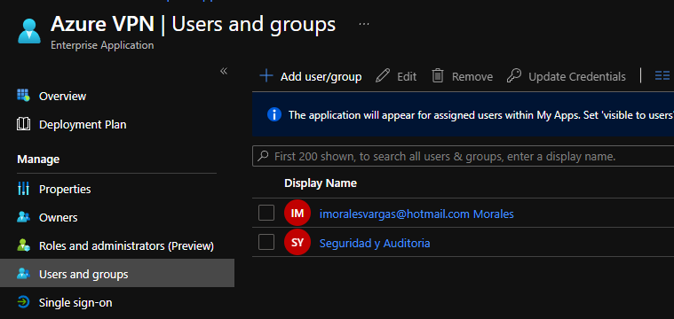
    - Para luego configurar el parametro previo a generar el archivo xaml cargable en la computadora cliente
    - 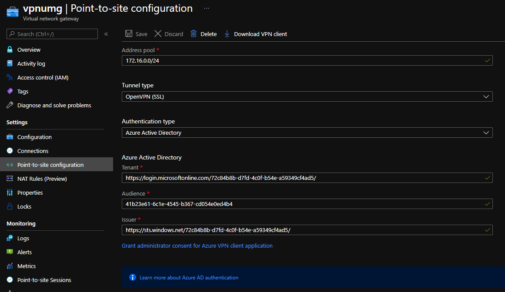
    - Y podremos descargar el archivo de configuración que utilizaremos en cada equipo cliente
    - 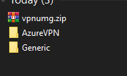

### Configuración VPN en equipo/servidor cliente

1. Accedemos a la tienda de microsoft para descargar la aplicación Azure VPN
    - 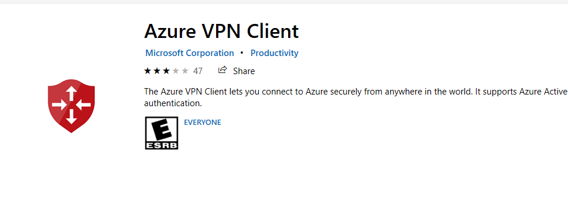
2. Abrimos la aplicación y escogemos la opción de importar
    - 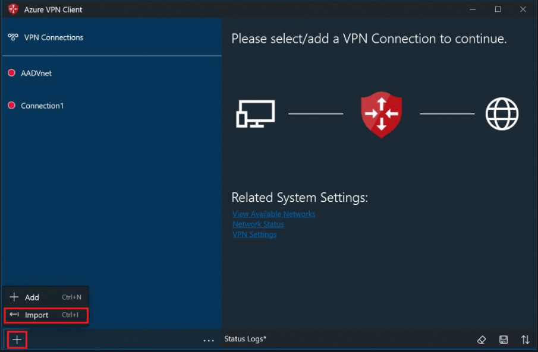
3. Ubicamos el archivo xaml previamente descargado y aceptamos los parametros
4. Le daremos click al boton "Conectar" 
    - 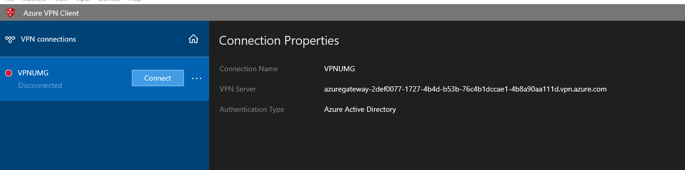
5. Ingresaremos el usuario y clave designado en el active directory que cuenta con el permiso de conexión
6. Verificamos que estamos conectados
   - 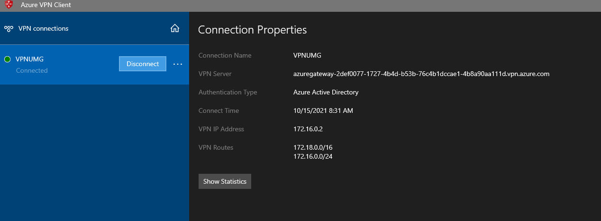
